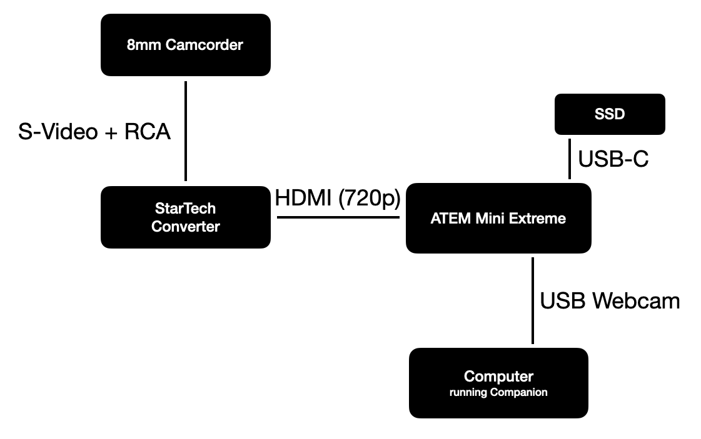

# Tape Dubbing Automation Scripts

I've been digitizing a bunch of old VHS and 8mm video tapes, and needed a few extra tools to make the process go faster. I wanted the process to be as hands off as possible, and automate as much as I can.

The camcorder is connected to a [StarTech S-Video to HDMI Converter](https://geni.us/DFMrAe) which sends a 720p signal into the ATEM. The ATEM upscales to 1080p, and then records to disk, or I can record using a Hyperdeck to a network drive. Using the webcam output, I can run a script on my computer that detects the blue screen that indicates playback has stopped, in order to automatically stop the recording and send a notification to my phone.

The script `auto-stop.sh` will watch a connected webcam and look for a series of blue frames, and run an action when enough blue frames are detected. You can use this to trigger a Companion button that stops an ATEM or Hyperdeck recording when a tape runs out.

